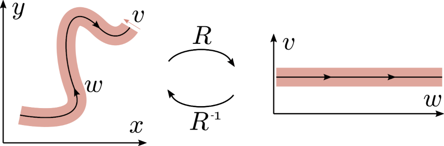
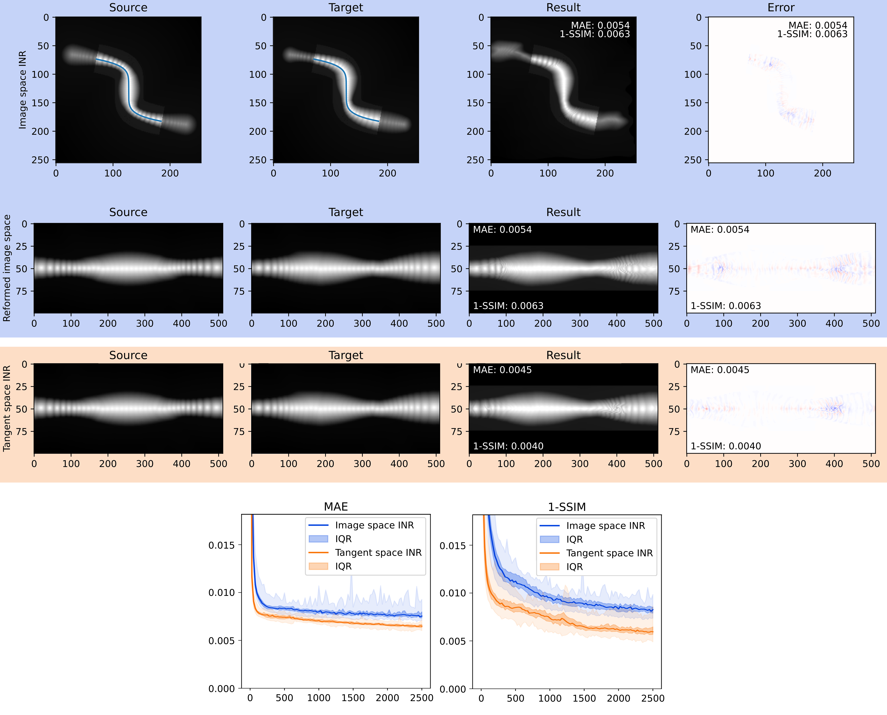

# Geometry-informed IDIR
Code for the paper _Deformable Image Registration with Geometry-informed Implicit Neural Representations_, van Harten et al. 2023, Medical Imaging with Deep Learning (MIDL 2023).

The code extends the [IDIR framework](https://github.com/MIAGroupUT/IDIR/) (Wolterink et al. 2022) with a tangent coordinate system. The deformation function is represented in the tangent space of a curve describing anatomical structures that influence the motion in our time series, which yields a space that is aligned with the expected motion. The geometric information is therefore explicitly encoded into the neural representation, reducing the complexity of the optimized deformation function. This coordinate space transformation is visualized below:

# Results
The figures below show a comparison of the baseline image-space registration (blue) with the proposed tangent space registration (orange) on a toy dataset representing an artificial bowel segment with simulated peristalsis.

# Running the code
This repository includes code for generating the abovementioned toy data. The script *run_toy_geometric_comparisson.py* optimizes this toy data using a number of random seeds and produces a plot like the one shown above. The same script contains instructions on how to run the tangent space registration on real data. 

# Reference
If you use this code, please cite the accompanying paper:

    @inproceedings{vanharten2023deformable,
      title={Deformable Image Registration with Geometry-informed Implicit Neural Representations},
      author={van Harten, Louis D and van Herten, Rudolf LM and Stoker, Jaap and Isgum, Ivana},
      booktitle={Medical Imaging with Deep Learning 2023},
      year={2023}
    }

